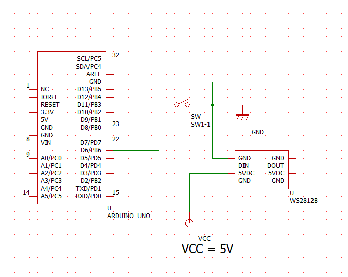

# acrylic_stand_illuminate
アドレサブルRGBでのライトアップ(arduinoで動作)

## 使用パーツ
  * arduino uno
  * WS2812B(アドレサブルRGB)
  * トグルスイッチ

## arduino との接続
  * VCC はUSB給電
  * VCC は arduino から取得もできるが、消費電流に注意
     + 参考: https://www.marutsu.co.jp/pc/static/large_order/WS2812B_0124

## 回路図

